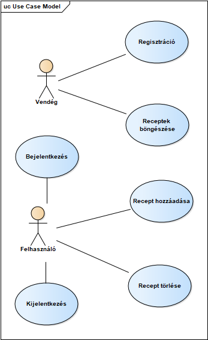

# Receptkönyv

# 1. Követelményanalízis

Az oldal egy egyszerű kis receptgyűjtemény. A receptek tartalmazzák az adott étel hozzávalóit és
elkészítésének leírását.

Regisztrációt követően a felhasználó saját receptet tud hozzáadni.
A feltöltött receptek láthatóságát a felhasználó publikusra vagy privátra tudja állítani. Ha a recept
publikus, minden felhasználó által elérhetővé válik, ha privát, akkor csak annak a felhasználónak
elérhető, aki feltöltötte azt.

A felhasználók az étel neve alapján vagy bizonyos kategóriák és kulcsszavak szerint tudnak
keresni a receptek között (pl.: bableves, palacsinta, előétel, levesek, főétel, desszert, saláták stb.).
Ezeket tetszés szerint mappákba tudják rendezni.

## 1.1 Funkcionális elvárások

- Regisztráció
- Publikus és privát receptek listázása
- Receptek közötti keresés (kulcsszavak, kategória, név alapján)
- Felhasználó adatlapjának megtekintése a feltöltött receptekkel

### Tagok által elérhető funkciók

- Saját és más receptek böngészése
- Receptek értékelése
- A „Saját recept lista” lehet publikus vagy privát
    - Publikus receptek láthatóak bárki számára.
    - Privát receptek csak annak láthatóak, aki feltöltötte azokat.
- Receptek mmappák módosítása, törlése

### Adminisztrátorok által elérhető funkciók

- Minden receptet lát

## 1.2 Nem funkcionális elvárások

- Felhasználóbarát, egyszerű, letisztult felület
- Jelszavas azonosítás, jelszavak biztonságos tárolása
- Privát receptek biztonságos elrejtése a látogatók elől

## 1.3 Szakterületi fogalomjegyzék

- Recept: tartozhat hozzá név, hozzávalók, főzési útmutató és kulcsszavak
- Recept mappa: tarozhat hozzá név, leírás, kulcsszavak
- Kulcsszó: egy rövid (1-2 szavas) kifejezés, amely összefüggésbe hozható egy adott
recepttel

## 1.4 Szerepkörök

- Felhasználó: regisztrált és bejelentkezett látogató
- Adminisztrátor

# 2. Implementáció

## 2.1 Felhasznált eszközök

- Git verziókezelő
- Spring Boot - Java
- Github a projekt közzétételéhez

## 2.2 Kapcsolatok

- User(author) - Recipe --> Egy - Sok kapcsolat
- User - Folder --> Egy - Sok kapcsolat
- Recipe - Keyword --> Sok - Sok kapcsolat
- Folder - Recipe --> Egy - Sok kapcsolat

## 2.3 Könyvtárstruktúra leírása

A "receptkonyv" mappán belül található a kiinduló mappánk az "src" mappa, ebben megtalálható a "main", illetve "test" mappa.

A "main" mappában található meg a "java" és a "resources" mappa.

A "resources" mappa tartalmazza például az "import.sql" fájlt, amelyben az adatbázisba betöltendő adataink találhatóak.

A fő mappánk a "java" mappán belül a "hu.receptek.receptkönyv", amely 3 almappában 4 fő komponensre bomlik. 

A  "controllers" mappában megtalálhatóak a kontrollerek, az "entities"-ben az alap osztályaink, a "repository" mappában pedig a 4 repository, amiket a kontrollerek használnak. 

## 2.4 Végpont tervek és leírások

### Recipe:
- GET - /recipes - Lekérdezi az összes receptet --> Bárki
- GET - /recipes/{id} - Lekérdez egyetlen receptet id alapján --> Bárki
- GET - /recipes/category/{category} - Kategória alapján listázza a recepteket --> Bárki
- GET - /recipes/own - Saját receptek lekérdezése --> User, Admin
- POST - /recipes - új receptet hoz létre --> User, Admin
- DELETE - /recipes/{id} - id alapján töröl egy receptet --> User sajátját, Admin bármit
- PUT - /recipes/{id} - id alapján egy recept adatain módosít --> User sajátját, Admin bármit

### Keyword:
- GET - /keywords - Lekérdezi az összes kulcsszót --> User, Admin
- GET - /keywords/{id} - Lekérdez egyetlen kulcsszót id alapján --> User, Admin
- POST - /keywords - új kulcsszót hoz létre --> User, Admin
- DELETE - /keywords/{id} - id alapján töröl egy kulcsszót --> User, Admin
- PUT - /keywords/{id} - id alapján egy kulcsszó adatain módosít --> User, Admin

### User:
- GET - /users --> Admin
- POST - /users - Felhasználó regisztrálása --> Bárki
- POST - /users/login - Bejelentkezés --> Bárki
- DELETE - /users/{id} --> Admin
- PUT - /users/{id} --> Admin

### Folder:
- GET - /folders - Lekérdezi az összes mappát --> User, Admin
- GET - /folders/{id} - Lekérdez egyetlen mappát id alapján --> User, Admin
- POST - /folders- új mappát hoz létre --> User, Admin
- DELETE - /folders/{id} - id alapján töröl egy mappát --> User, Admin
- PUT - /folders/{id} - id alapján egy mappa adatain módosít --> User, Admin

# Felhasználói felület

## 3.1 Funkciók

### Vendégek számára
- Regisztráció
- Receptek böngészése kategóriák szerint

### Regisztráció és bejelentkezés után
- Bejelentkezés
- Receptek böngészése kategóriák szerint
- Saját receptek listázása
- Recept hozzáadása
- Recept törlése

## 3.2 Használati eset diagram

## 3.3 Felhasználói dokumentáció

### A program használata

A kezdőoldalon lehetőség van regisztrálni, bejelentkezni vagy vendégként lépni be az alkalmazásba. Vendégek számára csak a közös adatbázis böngészése lehetséges.
Belépés után a Receptek menüpont alatt kategóriánként megtalálhatóak a feltöltött receptek. A kártyákon megjelenő receptek címére kattintva érhető el a hozzávalók listája és az elkészítési útmutató. Regisztrált felhasználó számára a Saját receptek fül alatt az általa feltöltött receptek vannak. Itt a + gombra kattintva tud új receptet rögzíteni. A kijelentkezés gombbal elhagyhatja az alkalmazást.

### Regisztráció

Az összes mező kitöltése kötelező! A felhasználónév legalább négy karakter hosszú. Az email cím megfelelő formátumú, valós email cím legyen. A jelszó legalább hat karakter hosszú. A jelszó megerősítése is szükséges, ha a két mező tartalma nem egyezik, a regisztráció sikertelen. Felugró mező jelzi, hogy sikeres volt-e a regisztráció.

### Új recept felvitele

Az összes mező kitöltése szükséges. A hozzávalók listáját egy sorban, vesszővel elválasztva szükséges megadni. A recept kategóriáját (előétel, főétel, desszert) és elérhetőségét (publikus, privát) egy legördülő listáról tudja kiválasztani. Amennyiben Publikusra állítja a receptet, úgy bárki más is látni fogja a későbbiekben. Mentés után a recept azonnal megjelenik a listákban. A beviteli panelből kikattintva bármikor megszüntethető a recept rögzítése. A hozzáadás gombra kattintva lesz végleges a mentés. Felugró mező jelzi, hogy sikeres volt-e a mentés. 

### Recept törlése

A Saját receptek fülre kattintva a regisztrált felhasználó megnézheti az eddig rögzített recepteket. A törlés (szemetes) ikonra kattintva törölhetőek a receptek. A törlés azonnali és nem visszavonható, ezért véletlen törlés esetén újra rögzíteni kell a receptet.

### Receptek böngészése

A Receptek fül alatt található a különböző kategóriák előképe. A receptek Előételek, Főételek és Desszertek csoportba vannak sorolva. A megfelelő kategória gombjára kattintva böngészhetőek a hozzá tartozó receptek. A más felhasználók által rögzített receptek is elérhetőek, amennyiben ők a recept rögzítésekor engedélyezték. Ezeket a recepteket a megkülönböztető képről lehet felismerni.
